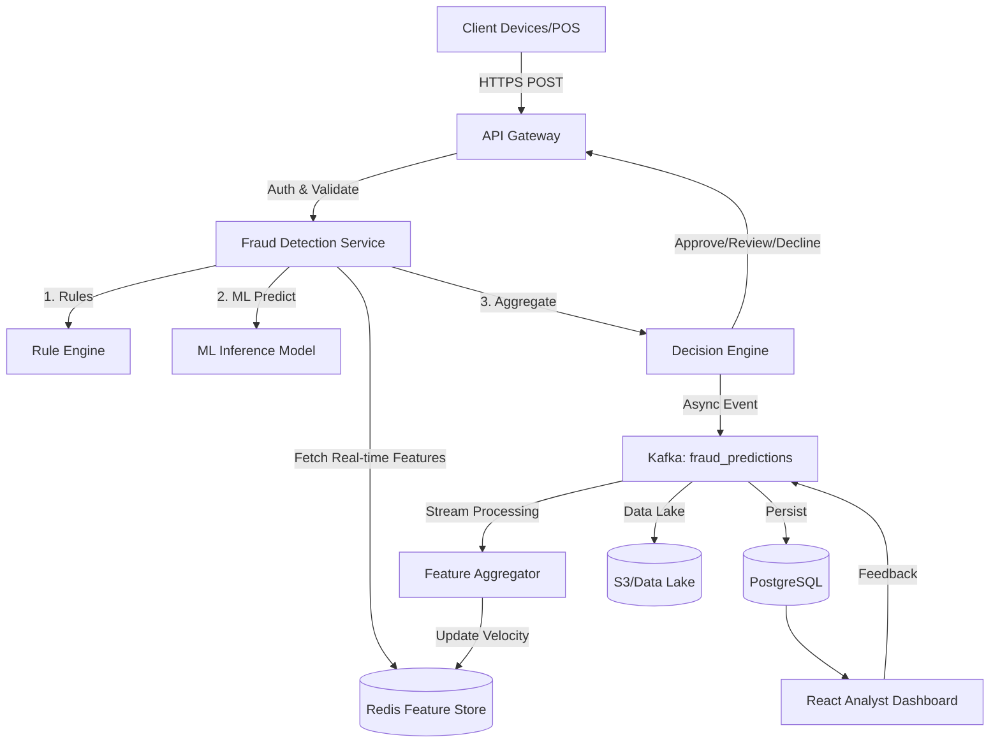
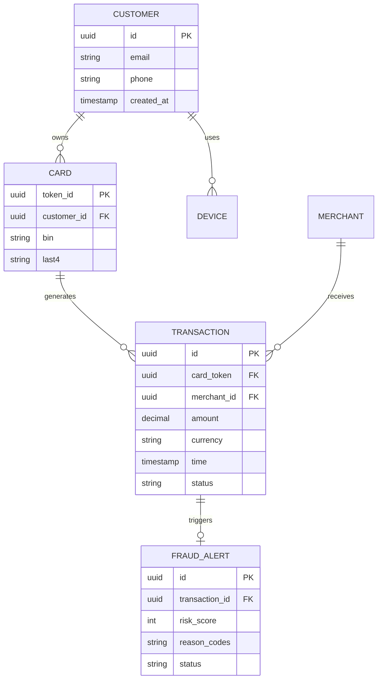
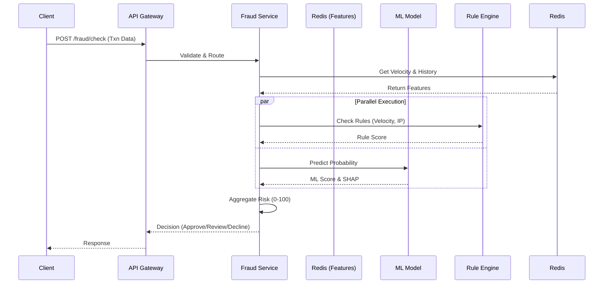

# Synopsis: Production-Grade Credit Card Fraud Detection System

## 1. Introduction
Credit card fraud is a rapidly growing global problem, costing the financial industry billions of dollars annually. As digital payments, e-commerce, and cross-border transactions proliferate, fraudsters continuously evolve their techniques, employing sophisticated methods such as account takeovers, synthetic identity fraud, and automated bot attacks. 

Traditional rule-based systems, while useful for deterministic checks (like blocking known bad IPs), are increasingly inadequate against dynamic, adaptive fraud patterns. They often result in high false-positive rates, which not only lead to lost revenue but also severely degrade the customer experience. 

This project proposes a **Production-Grade Credit Card Fraud Detection System**—a scalable, real-time, machine-learning-driven platform designed to detect fraudulent transactions within milliseconds. The system mirrors real-world architectures used by leading fintech companies and banks, incorporating advanced data ingestion, real-time feature engineering, multi-model machine learning, anomaly detection, and graph-based behavioral analysis. Furthermore, it emphasizes security (PCI DSS compliance), explainable AI (XAI) for auditability, and a robust MLOps pipeline to ensure continuous model monitoring and retraining against data drift.

### Core Definitions
- **Fraud Detection:** Identifying fraudulent activity as it happens or after the fact.
- **Fraud Prevention:** Proactively stopping a transaction before authorization.
- **Fraud Investigation:** Manual review by analysts of suspicious alerts.
- **Fraud Monitoring:** Continuous observation of transaction patterns and system health.
- **Fraud Scoring:** Assigning a quantitative risk score (0-100) to an event.
- **Fraud Blocking:** Automated decline of transactions exceeding a specific risk threshold.

---

## 2. Problem Statement
**The Business Problem:**
Financial institutions must balance fraud loss reduction with customer experience. High false-positive rates (declining legitimate transactions) cause customer churn and reputational damage. The system must minimize fraud losses while maximizing the approval rate of legitimate transactions.

**The Technical Problem:**
Detecting fraud requires evaluating complex relationships and historical patterns in real-time (usually <100ms latency budget). Datasets are massively imbalanced (legitimate transactions vastly outnumber fraudulent ones), and fraud patterns change rapidly (concept drift). 

**Gaps in Existing Systems:**
1. **Rule-Only Engines:** Brittle, hard to maintain, and easily bypassed by new fraud vectors.
2. **High Latency:** Batch processing cannot prevent fraud in real-time.
3. **Black Box AI:** Lack of explainability makes it impossible to comply with regulations or assist analysts in investigations.
4. **Poor Feedback Loops:** Delays in label generation (chargebacks can take 30-90 days) lead to stale models.

**Need for the Proposed Work:**
There is a critical need for an end-to-end, multi-layered architecture that combines deterministic rules, supervised machine learning, unsupervised anomaly detection, and graph intelligence, supported by a modern tech stack (Kafka, Redis, Kubernetes) to ensure high availability, scalability, and sub-second latency.

---

## 3. Objectives
- **To design and develop** a scalable, real-time transaction ingestion and processing pipeline capable of handling high throughput.
- **To develop** a multi-layered fraud detection engine combining Rule Engines, Supervised ML (XGBoost/LightGBM), and Unsupervised ML (Isolation Forest).
- **To implement** an online/offline feature store to prevent training-serving skew and compute real-time velocity features.
- **To ensure** high model explainability using SHAP and reason codes to aid human analysts and ensure regulatory compliance.
- **To evaluate** model performance using appropriate metrics for imbalanced datasets (PR-AUC, F1-Score, False Positive Rate) rather than mere accuracy.
- **To construct** a complete MLOps pipeline for continuous training, model registry, and data drift monitoring.
- **To build** a secure, PCI-compliant architecture with role-based access control, encryption, and data tokenization.

---

## 4. Scope of the Project
**Included in Scope:**
- Real-time transaction ingestion via API Gateway and Kafka.
- Data preprocessing and feature engineering (velocity, geographic, behavioral).
- Multi-model ML pipeline with explainability (SHAP).
- Rule and decision engine for final risk scoring (0-100).
- Analyst dashboard for investigation and feedback.
- MLOps lifecycle (MLflow, drift monitoring).
- Student MVP architecture separation for feasible academic implementation.

**Not Included in Scope (Limits & Constraints):**
- Actual processing/clearing of funds (simulated only).
- Storage of raw Primary Account Numbers (PAN) or CVV (strictly tokenized).
- Hardware security modules (HSM) for key generation (software KMS used).

**Assumptions:**
- Transactions arrive as JSON payloads from a payment gateway.
- Labels for training are provided historically, with simulated delayed chargebacks for live data.

---

## 5. Literature Review
Historically, fraud detection relied on **Rule-Based Expert Systems**, which suffered from high maintenance costs and low adaptability. The transition to **Machine Learning** introduced algorithms like Logistic Regression and Random Forests. Recent advancements emphasize **Gradient Boosting Machines (XGBoost, LightGBM)** for tabular data and **Graph Neural Networks (GNNs)** for relational data (fraud rings).

**Limitations of existing academic works:**
- Often ignore the real-time engineering constraints (feature stores, streaming).
- Heavily rely on accuracy over PR-AUC on static, unrealistic public datasets.
- Neglect MLOps, CI/CD, and concept drift handling.
- Lack explainability frameworks necessary for compliance.

This project bridges the gap by proposing an enterprise-grade architecture that moves beyond a simple Jupyter Notebook model into a fully deployable, observable, and scalable system.

---

## 6. Methodology / Proposed System

### 6.1. System Architecture Overview
The system is divided into several interconnected layers:
1. **Client / Transaction Layer:** POS, ATM, E-commerce, Mobile apps send requests.
2. **Ingestion Layer:** API Gateway handles authentication. Kafka streams events asynchronously.
3. **Real-Time Inference Layer:** Retrieves features from Redis, runs rules, evaluates ML models, aggregates scores, and returns a decision within milliseconds.
4. **Data Architecture:** PostgreSQL (Operational), S3 (Data Lake), Snowflake/BigQuery (Data Warehouse).
5. **MLOps Layer:** MLflow tracks experiments; monitoring tools watch for drift.
6. **Frontend/Investigation:** React dashboard for human analysts.

### 6.2. High-Level Architecture Diagram (Mermaid)

### 6.3. Transaction Ingestion Layer
- **API Gateway:** Entry point. Handles rate limiting, JWT validation.
- **Message Queue (Kafka):** Ensures high throughput and fault tolerance.
  - Topics: `transactions`, `fraud_predictions`, `investigation_events`.
  - Guarantees idempotency via `transaction_id`.

### 6.4. Data Architecture & Feature Store
- **Operational DB (PostgreSQL):** Stores customer profiles, tokenized cards, alerts, investigation cases.
- **Online Feature Store (Redis):** Ultra-low latency storage for real-time velocity features (e.g., "amount spent in last 1 hour").
- **Offline Feature Store (Postgres/S3):** For batch training.

### 6.5. Fraud Label Architecture & Imbalanced Data
- **Labels:** Come from confirmed chargebacks (delayed by 30+ days) or manual analyst review.
- **Handling Imbalance:** Use SMOTE for oversampling (with caution), class weights, or focal loss.
- **Metrics:** Prioritize **PR-AUC, Recall, and False Positive Rate** over Accuracy.

### 6.6. Machine Learning Architecture (Multi-Layered)
1. **Layer 1: Rule Engine:** Catches obvious fraud (e.g., impossible travel, velocity limits).
2. **Layer 2: Supervised ML:** XGBoost/LightGBM trained on historical labeled data.
3. **Layer 3: Unsupervised/Anomaly:** Isolation Forest to detect novel, zero-day fraud patterns.
4. **Layer 4: Risk Aggregator:** Normalizes and weights scores into a final 0-100 risk score.

**Scoring Formula:**
`Final Score = (w1 * RuleScore) + (w2 * ML_Prob) + (w3 * AnomalyScore) + (w4 * VelocityRisk)`

**Decision Engine:**
- **0-30:** Approve
- **31-75:** Step-up (MFA/OTP) or Analyst Review
- **76-100:** Block

### 6.7. Feature Engineering
- **Transaction:** Amount, time, currency, merchant category.
- **Velocity:** Transactions in last 1m, 1h, 24h.
- **Geographic:** Distance from last transaction, impossible travel.
- **Device/Network:** IP reputation, new device indicator.
- **Behavioral:** Deviation from median spend.

### 6.8. Explainable AI (XAI)
Every decline must be explainable. Using **SHAP (SHapley Additive exPlanations)**, the system outputs Reason Codes.
*Example:* Decline Reason: 1. Amount is 8.4x customer average. 2. Device is new. 3. Merchant category is high risk.

### 6.9. MLOps & Model Monitoring
- **MLflow:** Tracks experiments, parameters, and model registry.
- **Data Drift:** Monitored using PSI (Population Stability Index) and KL divergence. If feature distribution changes significantly, an alert triggers retraining.
- **Feedback Loop:** Analyst tags a blocked transaction as "False Positive" -> Feedback sent to Kafka -> Label updated in DB -> Nightly retraining pipeline ingests new labels.

### 6.10. Security & Compliance (PCI DSS)
- **Tokenization:** Raw card numbers (PAN) and CVV are NEVER stored. They are tokenized at the gateway.
- **Data Privacy:** PII is encrypted at rest (AES-256) and in transit (TLS 1.3).
- **Access Control:** RBAC for APIs and Analyst Dashboard.
- **Threat Mitigation:** Rate limiting prevents card testing/credential stuffing. WAF protects against injection attacks.

---

## 7. Module Description

### 1. Ingestion & API Module
**Components:** FastAPI Backend, API Gateway.
**Function:** Receives transactions, validates schemas, tokenizes sensitive data, and routes to Kafka and the inference engine. Handles synchronous responses for payment gateways.

### 2. Feature Engineering & State Module
**Components:** Redis, Kafka Consumers (or Flink).
**Function:** Maintains state for customers and cards. Calculates sliding window velocity features (e.g., "count of transactions in last 5 mins") in real-time.

### 3. Machine Learning Inference Module
**Components:** Python, XGBoost, Isolation Forest, SHAP.
**Function:** Loads registered models from MLflow. Executes rules, predicts probabilities, aggregates risk scores, and generates explainability reason codes.

### 4. Analyst Dashboard & Investigation Module
**Components:** React, TypeScript, TailwindCSS.
**Function:** Provides UI for analysts to monitor system health, view alerts, investigate suspicious transactions (showing graph networks of shared IPs/Devices), and provide feedback (True/False Positive).

### 5. MLOps & Monitoring Module
**Components:** MLflow, Prometheus, Grafana.
**Function:** Tracks system latency (P95/P99), throughput, model drift, feature drift, and business metrics (Fraud Loss vs. Block Rate). Automates retraining pipelines.

---

## 8. Expected Outcomes
1. **Real-time Detection:** Sub-100ms latency for fraud scoring.
2. **High Precision/Recall:** Improved detection of complex fraud rings with fewer false positives compared to purely rule-based systems.
3. **Explainability:** Clear, actionable reason codes for every blocked transaction.
4. **Scalability:** Ability to handle thousands of Transactions Per Second (TPS) using Kafka and Kubernetes.
5. **Continuous Learning:** Automated feedback loops that adapt to new fraud patterns (concept drift).

---

## 9. Hardware/Software Requirements

### Production Requirements
- **Cloud:** AWS (EKS for compute, MSK for Kafka, RDS for PostgreSQL, ElastiCache for Redis, SageMaker/EC2 for ML).
- **Infrastructure as Code:** Terraform, Docker, Kubernetes (Helm).

### Student MVP Requirements (Local/Academic)
- **Hardware:** Standard laptop (8GB+ RAM, multi-core CPU).
- **Software/Stack:**
  - **Frontend:** React + Vite
  - **Backend/API:** Python + FastAPI
  - **Database:** PostgreSQL (Dockerized)
  - **Cache/State:** Redis (Dockerized)
  - **ML:** Scikit-learn, XGBoost, SHAP
  - **Tracking:** MLflow (Local)

---

## 10. Work Plan / Timeline (Implementation Roadmap)

| Phase | Objective | Duration | Tasks |
|-------|-----------|----------|-------|
| **1** | **Setup & Architecture** | Week 1 | Repo setup, Docker compose, Database schemas (SQL). |
| **2** | **Data & Preprocessing** | Week 2 | EDA on public dataset (e.g., Kaggle IEEE-CIS), handle imbalance, engineer offline features. |
| **3** | **ML Modeling** | Week 3 | Train baseline models, XGBoost, tune hyperparameters, implement SHAP. |
| **4** | **Backend APIs** | Week 4 | Develop FastAPI endpoints, integrate rule engine and ML model. |
| **5** | **Feature Store & State** | Week 5 | Setup Redis, implement real-time velocity feature calculation. |
| **6** | **Frontend Dashboard** | Week 6 | Build React UI for alerts and transaction monitoring. |
| **7** | **Integration & Testing** | Week 7 | End-to-end testing, performance/load testing API latency. |
| **8** | **Documentation & Final** | Week 8 | Finalize MLOps tracking, write ADRs, prepare presentation. |

---

## Detailed Architectural Appendices

### A. Data Models (ER Diagram)

### B. Real-Time Inference Sequence Diagram

### C. Student MVP Architecture vs Production
**Production:**
Uses Kafka for event streaming, Kubernetes for auto-scaling, distributed Redis cluster, Flink for stream feature processing, and highly segmented networks.

**Student MVP:**
- Direct REST API calls (FastAPI).
- Synchronous feature lookup from a local Redis container.
- PostgreSQL for data persistence.
- ML model loaded as a `.pkl` or via local MLflow.
- Single Docker Compose file orchestrating React, FastAPI, Postgres, and Redis.

### D. Public Datasets for MVP
- **Kaggle Credit Card Fraud Detection (European Cardholders):** Good for baseline anomaly detection, heavily PCA transformed.
- **IEEE-CIS Fraud Detection:** Excellent for complex feature engineering, contains identity and transaction tables.
*(Note: Public datasets are anonymized and static. Real systems require temporal splitting and dynamic feature generation).*
